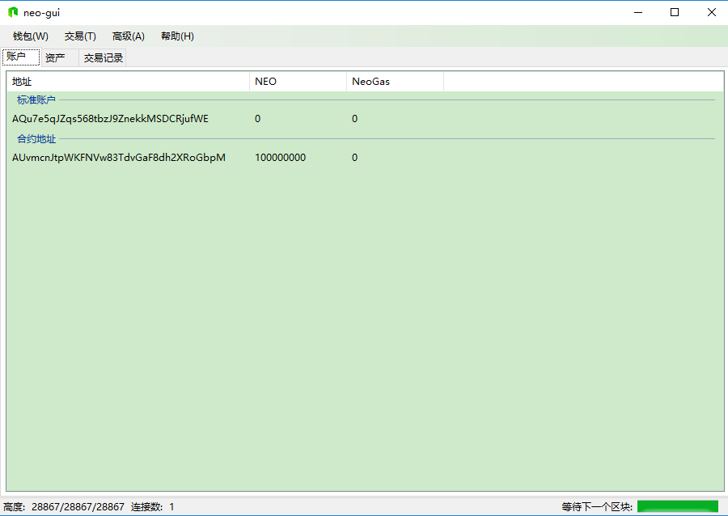
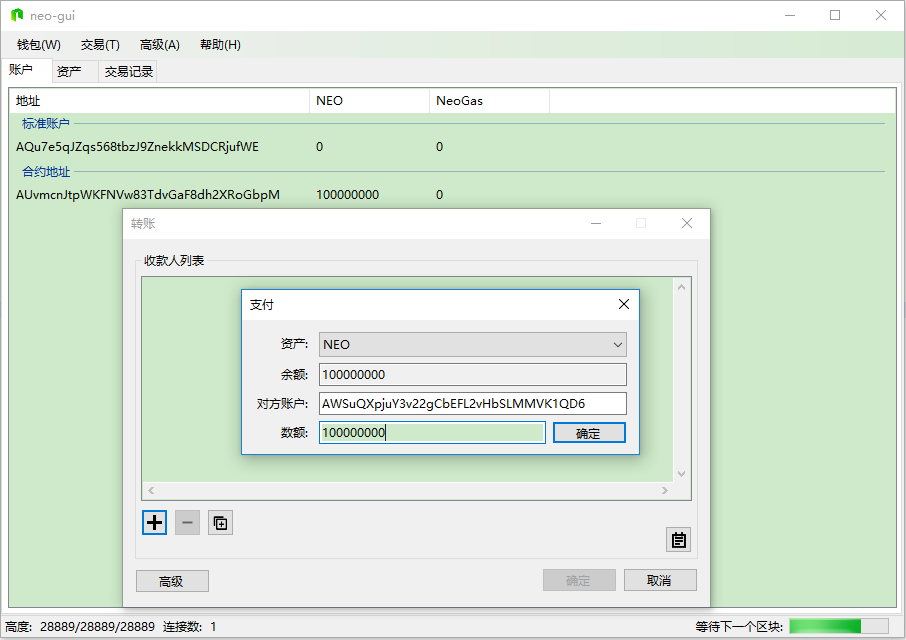
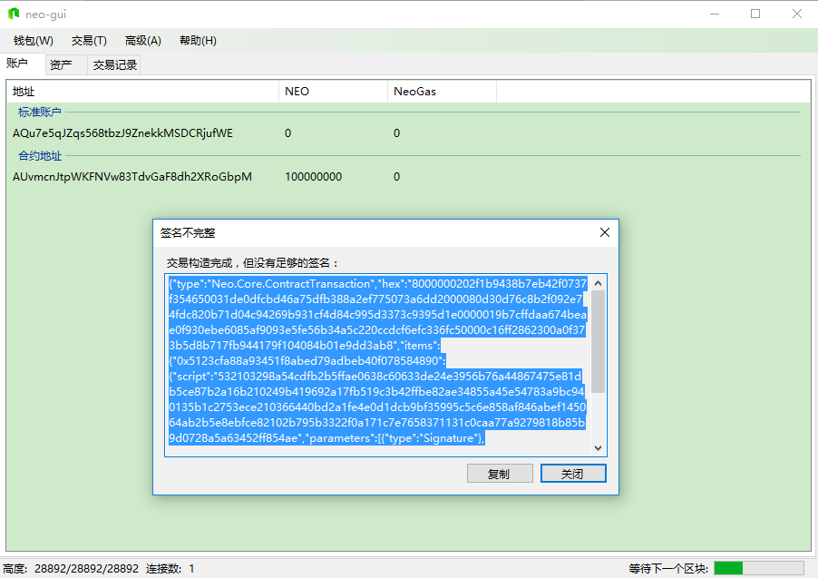
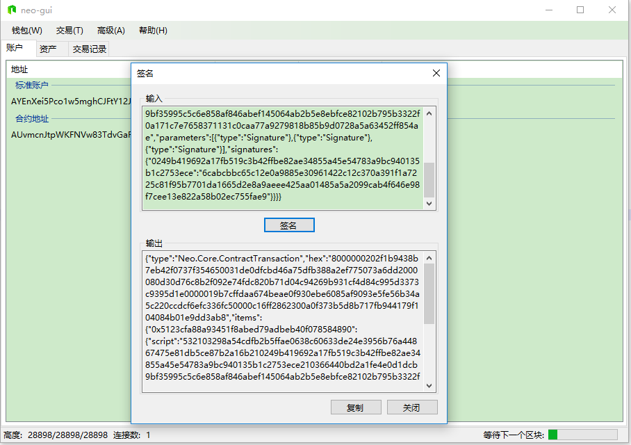
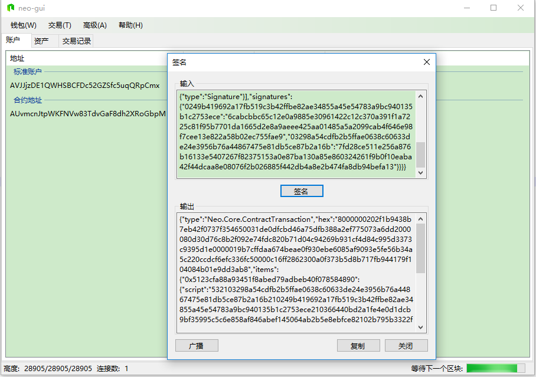
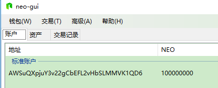

# **从记账人多重签名合约中取出初始块中的1亿Neo**

## 准备config.json文件和protocol.json文件

- config.json

```json
{
  "ApplicationConfiguration": {
    "Paths": {
      "Chain": "Chain_{0}",
      "Index": "Index_{0}",
      "CertCache": "Certs"
    },
    "P2P": {
      "Port": 10333,
      "WsPort": 10334
    },
    "Urls": {
      "AddressUrl": "https://neoscan.io/address/{0}",
      "AssetUrl": "https://neoscan.io/api/main_net/v1/get_asset/{0}",
      "TransactionUrl": "https://neoscan.io/transaction/{0}"
    }
  }
}
```

- protocal.json

```json
{
    "ProtocolConfiguration":{
        "Magic":9726190,
        "AddressVersion":23,
        "StandbyValidators":[
            "0249b419692a17fb519c3b42ffbe82ae34855a45e54783a9bc940135b1c2753ece",
            "03298a54cdfb2b5ffae0638c60633de24e3956b76a44867475e81db5ce87b2a16b",
            "02b795b3322f0a171c7e7658371131c0caa77a9279818b85b9d0728a5a63452ff8",
            "0366440bd2a1fe4e0d1dcb9bf35995c5c6e858af846abef145064ab2b5e8ebfce8"
        ],
        "SeedList":[
            "x.x.x.x:10333",
            "x.x.x.x:20333",
            "x.x.x.x:30333",
            "x.x.x.x:40333"
        ],
        "SystemFee":{
            "EnrollmentTransaction":1000,
            "IssueTransaction":500,
            "PublishTransaction":500,
            "RegisterTransaction":10000
        }
    }
}
```

**注意，文件中`x.x.x.x`替换成私链节点运行机器的所在IP**

## 下载Neo-GUI

[下载地址]: https://github.com/neo-project/neo-gui/releases/download/v2.9.0/neo-gui-windows.zip

解压下载的软件包，进入文件夹，将步骤一得到的`config.json`和`protocol.json`文件替换对应的文件。

运行`neo-gui.exe`

## 取出Nei

1. 打开`0.json` 0号记账人钱包，密码123456 

   

   可以看到一个合约地址中有1亿Neo（是不是有点小兴奋啊），这个合约地址是由4个记账人公钥构造的多重签名地址合约，需要至少3个记账人钱包签名才能转出。

2. 新建一个新的非记账人钱包，比如neo_private_net_test_0.json, 记住它的地址，比如AWSuQXpjuY3v22gCbEFL2vHbSLMMVK1QD6

   打开0号记账人钱包，并【交易】-【转账】到上面地址

   

   确定后会提示签名不足

   

3. 没事，我们先把整个内容复制出来，然后打开1号记账人钱包，【交易】-【签名】对这笔转账交易进行第二人签名。

   

   复制输出，然后打开2号记账人钱包，【交易】-【签名】对这笔转账交易进行第三人签名。

   

   此时，左下角出现【广播】按钮，代表交易签名已经完备。

4. 点击【广播】将交易发送到私链上进行共识

   等到15秒左右，1亿Neo就到你建立的那个AWSuQXpjuY3v22gCbEFL2vHbSLMMVK1QD6地址中了。

   

   GAS是通过生成区块，按照Neo持有量，不断产生的。

   通过对自己地址转账，然后【高级】-【提取NeoGas】就能将GAS提取到自己地址。

   *好了，至此你有用了一条新的Neo链、1亿Neo、无数Gas，开始你的表演吧。*